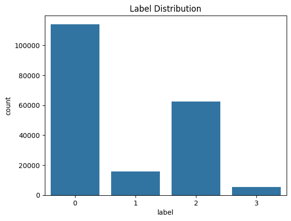
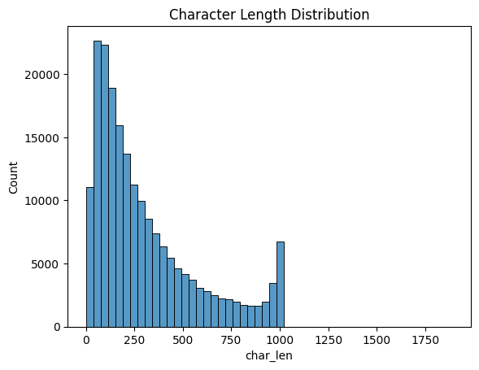
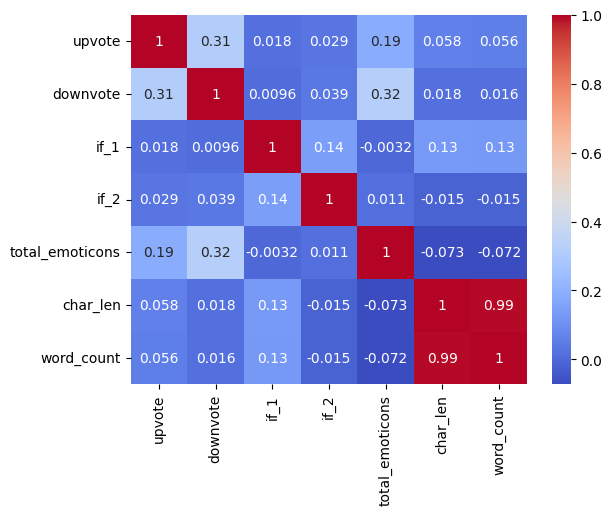
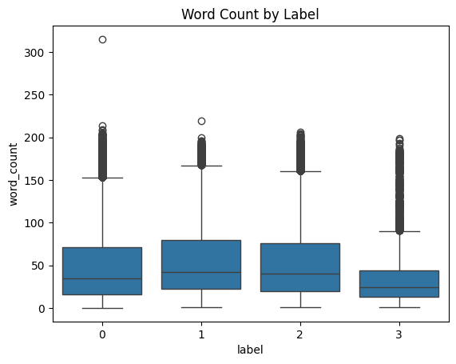
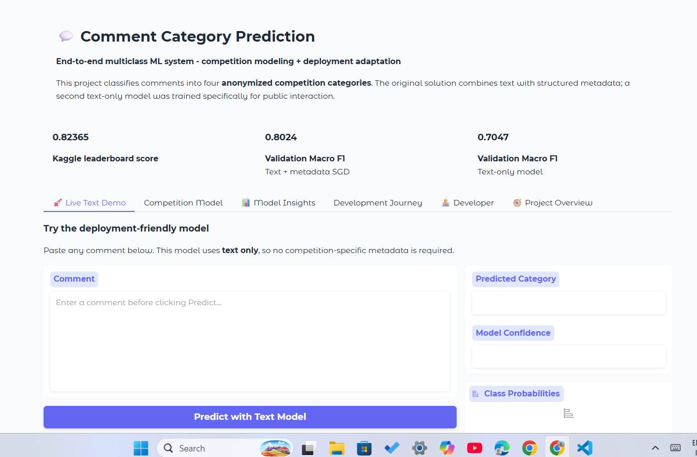
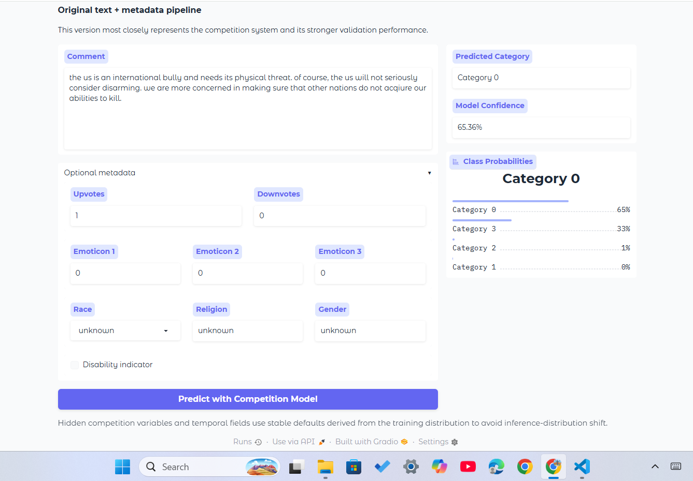
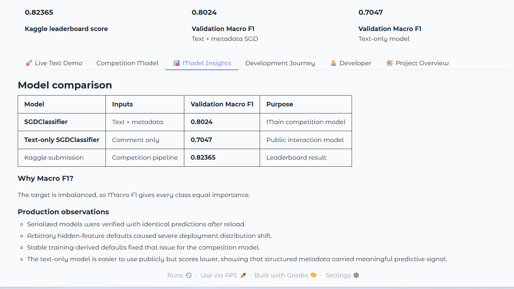
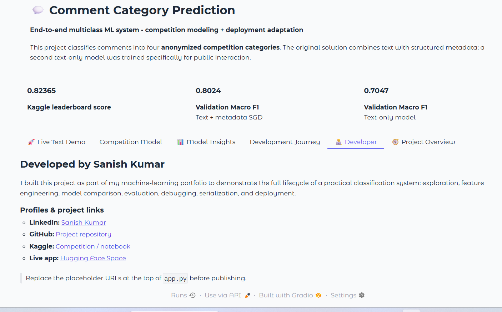

# Comment Category Prediction Challenge

> An end-to-end multiclass machine learning project covering exploratory analysis, feature engineering, text modeling, model comparison, debugging, serialization, and public deployment.

[](#)
[](#)
[](#)
[](#)

## Project Overview

This project started as a multiclass comment-category prediction challenge and gradually became a complete machine learning application.

The task was not only about classifying text. The dataset also contained structured information such as votes, emoticons, timestamps, demographic fields, hidden numerical variables, and post-level context. That made the project a useful opportunity to work with **mixed tabular + text data**, class imbalance, feature engineering, model comparison, inference debugging, and finally deployment.

The final public application uses **two production models**:

- **Competition model** — text + structured metadata, designed to stay close to the original competition setup.
- **Text-only deployment model** — accepts only a comment and is easier for anyone to try publicly.

This two-model setup came from an important deployment lesson: the competition model performs better when metadata is available, but arbitrary defaults for missing metadata can distort predictions in a live app. Instead of hiding that limitation, I treated it as a real engineering problem and adapted the deployment accordingly.

---

## Live Project

- **Live App:** `https://sanishkumarsingh-comment-category-prediction-challenge.hf.space/`
- **GitHub Repository:** `https://github.com/SanishCode21/comments-category-prediction-challenge.git`
- **Kaggle Competition:** `https://www.kaggle.com/competitions/comment-category-prediction-challenge/overview`
- **Notebook:** `https://colab.research.google.com/drive/1rnMK-AG9wUr937dHUoPtxNxZOYb4ygif?usp=sharing`
- **LinkedIn:** `https://www.linkedin.com/in/sanish-kumar-singh-163679289`


---

## Key Results

| Model / Result | Score |
|---|---:|
| Competition SGDClassifier — Validation Macro F1 | **0.8024** |
| Text-only SGDClassifier — Validation Macro F1 | **0.7047** |
| Latest weighted ensemble — Validation Macro F1 | **0.8055** |
| Kaggle leaderboard score | **0.82365** |

The final leaderboard score became one of the most valuable parts of the project because it came after a difficult debugging phase rather than from simply training more models.

---

## Problem Statement

The goal was to predict one of four anonymized labels:

```text
0, 1, 2, 3
```

for each comment.

The dataset contained:

- raw comment text
- created date
- post ID
- emoticon counts
- upvotes and downvotes
- hidden numerical features (`if_1`, `if_2`)
- demographic fields such as race, religion, gender, and disability
- target label

The evaluation focus was **Macro F1**, which was important because the dataset was strongly imbalanced.

### Class Distribution

The training labels were approximately:

| Label | Proportion |
|---|---:|
| 0 | 57.66% |
| 2 | 31.54% |
| 1 | 8.04% |
| 3 | 2.76% |

Because of this imbalance, plain accuracy would not have been enough. Macro F1 gave equal importance to all four classes.

---

## Exploratory Data Analysis

The EDA stage helped me understand both the text and metadata before modeling.

Some of the main observations were:

- `char_len` and `word_count` were strongly correlated.
- Comment lengths were highly right-skewed.
- Upvotes and downvotes were also skewed.
- Race, religion, and gender had substantial missing values.
- `post_id` had only a small number of unique values compared with the total row count, and the post sizes were highly uneven.
- Hidden variables `if_1` and `if_2` had very different scales and required careful handling.
- Emoticon and vote behavior varied significantly across comments.
- The label distribution was strongly imbalanced.

### EDA Visuals

Add your existing figures from the `assets/` folder here:

```md




```

Use the exact filenames from your repository.

---

## Feature Engineering

I built a reusable feature-engineering pipeline instead of relying only on raw columns.

### Date and Time Features

From `created_date`:

- day
- month
- year
- hour
- weekend indicator

### Text Statistics

From `comment`:

- character length
- word count
- average word length
- long-comment flag

### Emoticon Features

- total emoticons
- emoticon density

### Vote Features

- net score
- total votes
- vote ratio

### Interaction Features

- engagement score
- emoticon × vote interaction

### Hidden Features

The hidden numerical columns were transformed using `log1p` during training.

### Categorical Handling

Missing values in:

- race
- religion
- gender

were replaced with `"unknown"`.

The deployment pipeline also preserves the exact column schema expected by the fitted scikit-learn model.

---

## Text Representation

The text pipeline combines:

- **word-level TF-IDF**
- **character-level TF-IDF**

This was useful because word n-grams capture vocabulary and phrases, while character n-grams help with spelling variations, informal language, abbreviations, and noisy user-generated text.

---

## Models Explored

I compared several classical machine learning approaches.

### Latest Experiments

| Model | Train Macro F1 | Validation Macro F1 |
|---|---:|---:|
| SGDClassifier | 0.8803 | **0.8029** |
| Logistic Regression | 0.8814 | 0.7979 |
| RidgeClassifier | 0.8745 | 0.7655 |
| Random Forest | 0.6135 | 0.4691 |

I also experimented earlier with **LightGBM**, but for the final retraining/deployment stage I removed it because the training time was too high for the size of the dataset and the improvement was not worth the extra cost for this project.

### Why SGDClassifier?

The final competition deployment uses:

```python
SGDClassifier(
    loss="log_loss",
    alpha=5e-6,
    max_iter=2000,
    class_weight="balanced"
)
```

It gave a strong balance of:

- validation performance
- training speed
- probability output
- compact model size
- deployment simplicity

The serialized competition pipeline is only a few MB, which made it practical for public hosting.

---

## Ensemble Experiment

I also tested a weighted probability ensemble across the strongest models.

The latest ensemble achieved:

```text
Validation Macro F1: 0.8055
```

This was slightly better than the best single model.

The ensemble was useful during experimentation, but I intentionally kept the deployed production app simpler by using compact SGD-based pipelines.

---

## The Biggest Debugging Challenge

One of the most important lessons from this project came from a leaderboard failure.

At one stage, the local validation score was strong, but the Kaggle leaderboard score dropped to approximately:

```text
0.3124
```

The submission predictions were heavily shifted toward one class, which did not match the behavior seen on validation data.

After investigating:

- submission format
- model class order
- validation prediction distribution
- test preprocessing
- engineered features
- train/test dataframe schemas

I found that the **train and test dataframes had the same columns but in a different order**.

That caused inference misalignment.

After explicitly reordering the test dataframe to match the training schema:

```python
test_df = test_df[X_train.columns]
```

the leaderboard score improved to:

```text
0.82365
```

This was one of the most valuable moments in the project because it reinforced that a strong model is not enough. **Inference consistency, schema control, and debugging discipline matter just as much as model selection.**

---

## Deployment Challenge: Distribution Shift

After the competition model was serialized and moved into a Gradio application, another issue appeared.

When arbitrary default values were used for hidden metadata such as `if_1`, `if_2`, and time-related features, the live app produced unrealistic class probabilities.

I diagnosed this by comparing:

- real validation prediction distribution
- real validation class distribution
- class-wise feature statistics
- single-row probabilities from real validation examples

The saved model itself was healthy.

The problem was the **synthetic live input distribution**.

### Fix

For the competition model:

- hidden features use stable defaults derived from the training distribution
- time-related fields also use training-distribution defaults
- the app exposes only meaningful user-facing metadata

I then trained a second **text-only model** for a cleaner public experience.

---

## Why Two Production Models?

### 1. Competition Model

Uses:

- comment text
- votes
- emoticons
- categorical metadata
- engineered numerical features

Validation Macro F1:

```text
0.8024
```

This model best represents the original competition setup.

### 2. Text-Only Model

Uses:

- word TF-IDF
- character TF-IDF
- SGDClassifier

Validation Macro F1:

```text
0.7047
```

This model is easier for a recruiter or visitor to test because they only need to paste a comment.

The lower score also shows something meaningful: **structured metadata contributed real predictive information in the original task.**

---

## Serialization and Reproducibility

The fitted pipelines were serialized using `cloudpickle`.

Environment used:

```text
scikit-learn: 1.6.1
numpy: 2.0.2
scipy: 1.15.3
cloudpickle: 3.1.1
```

I verified serialization by comparing original and reloaded predictions:

```text
Identical predictions: True
```

This gave confidence that the deployed models were reproducing the local pipeline correctly.

---

## Public Deployment

The final application is deployed using:

- **Gradio**
- **Hugging Face Spaces**
- **ZeroGPU hosting**
- serialized scikit-learn pipelines

The interface includes:

- Live Text Demo
- Competition Model
- Model Insights
- Development Journey
- Project Overview
- Developer / profile links

The app also includes real validation examples so visitors can test comments that are representative of the original dataset.

### App UI

Add screenshots from your `assets/` folder:

```md




```

Use the real filenames from your repo.

---

## Project Structure

```text
comments-category-prediction-challenge/
│
├── app.py
├── inference.py
├── feature_engineering.py
├── smoke_test.py
├── .gitignore
├── requirements.txt
├── README.md
│
├── models/
│   ├── sgd_classifier_pipeline.pkl
│   └── text_only_sgd_pipeline.pkl
│
├── notebooks/
│   └── eda-v1.ipynb
│
└── assets/
    ├── app_ui.png
    ├── ...
    └── ...
```

---

## Run Locally

Clone the repository:

```bash
git clone https://github.com/SanishCode21/comments-category-prediction-challenge.git
cd comments-category-prediction-challenge
```

Create and activate a virtual environment:

```bash
python -m venv venv
```

Windows:

```bash
venv\Scripts\activate
```

Install dependencies:

```bash
pip install -r requirements.txt
```

Run the application:

```bash
python app.py
```

Then open:

```text
http://127.0.0.1:7860
```

---

## What I Learned

This project taught me much more than how to fit a classifier.

I learned how to:

- work with mixed text + tabular datasets
- choose metrics for imbalanced classification
- engineer useful features from noisy user-generated content
- compare multiple model families
- combine word and character TF-IDF
- use scikit-learn pipelines and `ColumnTransformer`
- debug train/test schema mismatches
- interpret suspicious prediction distributions
- separate validation problems from deployment problems
- detect inference-time distribution shift
- serialize and reload complete ML pipelines
- design a deployment-specific model when the competition model is not naturally suited to public input
- build and publish an interactive ML application

The biggest takeaway was that **production ML is not only about model accuracy**. A model can perform well locally and still fail if preprocessing, schema order, default features, or deployment assumptions are inconsistent.

---

## Skills Demonstrated

This project demonstrates practical experience with:

- Python
- pandas
- NumPy
- scikit-learn
- TF-IDF
- text classification
- feature engineering
- imbalanced classification
- model evaluation
- probability ensembling
- pipeline design
- serialization
- Gradio
- Hugging Face Spaces
- Git / GitHub
- debugging and deployment

---

## Career Relevance

This project is especially relevant to roles involving:

- Machine Learning Engineering
- Applied Machine Learning
- NLP / Text Classification
- AI Engineering
- Data Science
- ML Application Development

For me, the most valuable part is that the project now represents the **complete lifecycle** rather than only a notebook:

```text
EDA
  ↓
Feature Engineering
  ↓
Model Training
  ↓
Validation
  ↓
Leaderboard Submission
  ↓
Debugging
  ↓
Serialization
  ↓
Inference Design
  ↓
Public Deployment
```

That end-to-end experience is the main reason I wanted to take the project beyond the competition stage.

---

## Future Improvements

Some improvements I would like to explore later:

- better probability calibration
- stronger text-only modeling
- cross-validation ensembling
- feature importance / explainability
- more robust experiment tracking
- improved model monitoring for live inputs
- API-based inference in addition to the Gradio UI

I intentionally stopped short of adding unnecessary complexity to the deployed version so the application remains lightweight, reproducible, and easy to understand.

---

## Developer

**Sanish Kumar**

I am building my career toward AI/ML engineering and using projects like this to strengthen my understanding of practical machine learning systems beyond coursework.

- **Live App:** `https://sanishkumarsingh-comment-category-prediction-challenge.hf.space/`
- **GitHub Repository:** `https://github.com/SanishCode21/comments-category-prediction-challenge.git`
- **Kaggle Competition:** `https://www.kaggle.com/competitions/comment-category-prediction-challenge/overview`
- **Notebook:** `https://colab.research.google.com/drive/1rnMK-AG9wUr937dHUoPtxNxZOYb4ygif?usp=sharing`
- **LinkedIn:** `https://www.linkedin.com/in/sanish-kumar-singh-163679289`

---

## Final Note

This project went through several iterations, mistakes, fixes, and deployment decisions.

That is exactly why I consider it valuable.

The final score matters, but the more important outcome was learning how to move from:

**“the model works in my notebook”**

to:

**“the full end-to-end production ML system workflows consistently for other people.”**

